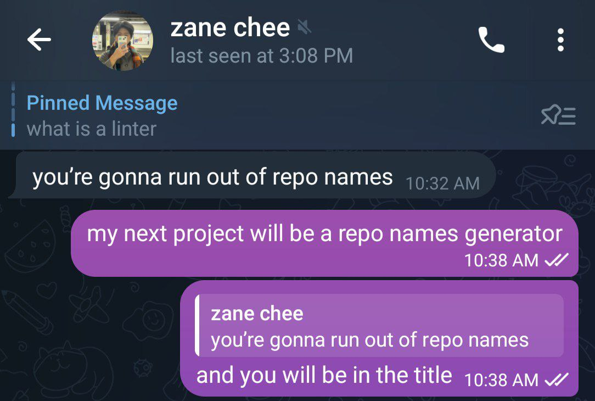

[](https://github.com/gongahkia/ygroorn/releases/tag/1.0.0)

# `You’re Gonna Run Out Of Repo Names`

A [CLI tool]() for brainstorming Github Repository names.

Henceforth abbreviated to `ygroorn`.

## Stack

* *Script*: [Python](https://www.python.org/), [JavaScript](https://developer.mozilla.org/en-US/docs/Web/JavaScript), [Ruby](https://www.ruby-lang.org/en/), [Go](https://go.dev/)
* *Package*: [Docker]()

## Usage

The below instructions are for running a packaged version of `ygroorn` locally.

To call `ygroorn` as a [Module](#python-module-instructions), [Library](#npm-library-instructions), [Gem](#ruby-gem-instructions) or [Package](#go-package-instructions), see the respective instructions [here](#coverage).

1. Execute the below.

```console
$ git clone https://github.com/gongahkia/ygroorn && cd ygroorn
```

2. To build and run the `ygroorn` Docker Image in interactive mode, run the below.

```console
$ docker build -t ygroorn-all .
$ docker run -it --rm ygroorn-all
```

## Architecture

```mermaid
flowchart TD
    subgraph Python
        PYCLI[CLI Typer]
        PYCore[core.py]
        PYTraits[traits.py]
        PYNaming[naming.py]
        PYEmbeddings[embeddings.py]
        PYUtils[utils.py]
        PYCLI --> PYCore
        PYCore --> PYTraits
        PYCore --> PYNaming
        PYCore --> PYEmbeddings
        PYCore --> PYUtils
        PYNaming --> PYUtils
    end

    subgraph NodeJS
        NJCLI[CLI Yargs]
        NJCore[core.js]
        NJTraits[traits.js]
        NJNaming[naming.js]
        NJEmbeddings[embeddings.js]
        NJUtils[utils.js]
        NJCLI --> NJCore
        NJCore --> NJTraits
        NJCore --> NJNaming
        NJCore --> NJEmbeddings
        NJCore --> NJUtils
        NJNaming --> NJUtils
    end

    subgraph Ruby
        RBCLI[CLI Thor]
        RBCore[core.rb]
        RBTraits[traits.rb]
        RBNaming[naming.rb]
        RBEmbeddings[embeddings.rb]
        RBUtils[utils.rb]
        RBCLI --> RBCore
        RBCore --> RBTraits
        RBCore --> RBNaming
        RBCore --> RBEmbeddings
        RBCore --> RBUtils
        RBNaming --> RBUtils
    end

    subgraph Go
        GOCLI[CLI Cobra]
        GOCore[core.go]
        GOTraits[traits.go]
        GONaming[naming.go]
        GOEmbeddings[embeddings.go]
        GOUtils[utils.go]
        GOCLI --> GOCore
        GOCore --> GOTraits
        GOCore --> GONaming
        GOCore --> GOEmbeddings
        GOCore --> GOUtils
        GONaming --> GOUtils
    end

    subgraph SharedConcepts
        UserInput["User Input (Description, Vibe, Theme, Language)"]
        WordVectors["Word Vector Models (GloVe/FastText)"]
        NamePatterns["Name Patterns"]
        Traits["Vibes, Themes, Languages"]
    end

    UserInput --> PYCLI
    UserInput --> NJCLI
    UserInput --> RBCLI
    UserInput --> GOCLI

    WordVectors --> PYEmbeddings
    WordVectors --> NJEmbeddings
    WordVectors --> RBEmbeddings
    WordVectors --> GOEmbeddings

    NamePatterns --> PYNaming
    NamePatterns --> NJNaming
    NamePatterns --> RBNaming
    NamePatterns --> GONaming

    Traits --> PYTraits
    Traits --> NJTraits
    Traits --> RBTraits
    Traits --> GOTraits

    classDef cli fill:#b3e6ff,stroke:#333,stroke-width:2px;
    classDef core fill:#e6ffe6,stroke:#333,stroke-width:2px;
    classDef traits fill:#fff5b3,stroke:#333,stroke-width:2px;
    classDef naming fill:#ffd9b3,stroke:#333,stroke-width:2px;
    classDef embeddings fill:#e6ccff,stroke:#333,stroke-width:2px;
    classDef utils fill:#cccccc,stroke:#333,stroke-width:2px;

    class PYCLI,NJCLI,RBCLI,GOCLI cli;
    class PYCore,NJCore,RBCore,GOCore core;
    class PYTraits,NJTraits,RBTraits,GOTraits traits;
    class PYNaming,NJNaming,RBNaming,GONaming naming;
    class PYEmbeddings,NJEmbeddings,RBEmbeddings,GOEmbeddings embeddings;
    class PYUtils,NJUtils,RBUtils,GOUtils utils;
```



## Coverage

`ygroorn` is currently served via the following sources.

* [Python Module](https://docs.python.org/3/tutorial/modules.html)
* [NPM Library](https://www.npmjs.com/)
* [Ruby Gem](https://rubygems.org/)
* [Go Package](https://pkg.go.dev/)

### Python Module Instructions

1. Install the [Python module](./python/).

```console
$ cd python
$ pip install .
```

2. Then run the `ygroorn` CLI.

```console
$ ygroorn generate "Some silly AI project" --vibe playful --theme tech --language English
```

3. Or call `ygroorn` directly within your project.

```py
import ygroorn
names = ygroorn.generate_repo_names("Some silly AI project", "playful", "tech", "English", 5)
print(names)
```

### NPM Library Instructions

1. Install the [Node.js package](./nodejs/).

```console
$ cd nodejs
$ npm install -g .
```

2. Then run the `ygroorn` CLI.

```console
$ ygroorn generate "Some silly AI project" --vibe playful --theme tech --language English
```

3. Or call `ygroorn` directly within your project.

```py
const { generateRepoNames } = require('ygroorn');
const names = generateRepoNames('Some silly AI project', 'playful', 'tech', 'English', 5);
console.log(names);
```

### Ruby Gem Instructions

1. Install the [Ruby Gem](./ruby/).

```console
$ cd ruby
$ gem build ygroorn.gemspec
$ gem install ./ygroorn-0.1.0.gem 
```

2. Then run the `ygroorn` CLI.

```console
$ ygroorn generate "Some silly AI project" --vibe playful --theme tech --language English
```

3. Or call `ygroorn` directly within your project.

```rb
require 'ygroorn'
names = Ygroorn.generate_repo_names('Some silly AI project', 'playful', 'tech', 'English', 5)
puts names
```

### Go Package Instructions

1. Install the [Go Package](./go/).

```console
$ cd go
$ go build -o ygroorn ./cmd/ygroorn
```

2. Then run the `ygroorn` CLI.

```console
$ ygroorn generate "Some silly AI project" --vibe playful --theme tech --language English
```

3. Or call `ygroorn` directly within your project.

```go
import "github.com/ygroorn/ygroorn/pkg"

names := pkg.GenerateRepoNames("A fun AI project", "playful", "tech", "English", 5)
fmt.Println(names)
```

## Reference

My thanks to [Zane Chee](https://www.linkedin.com/in/zanechee/) ([@injaneity](https://github.com/injaneity)). The inspiration for this project sprouted from the below conversation with him.

<div align="center">
    
</div>